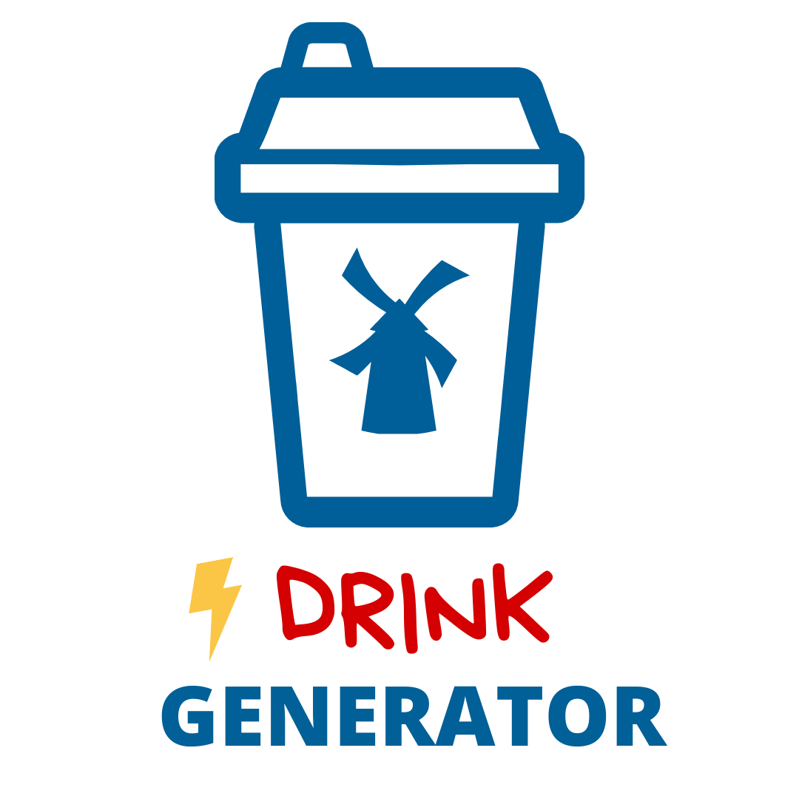
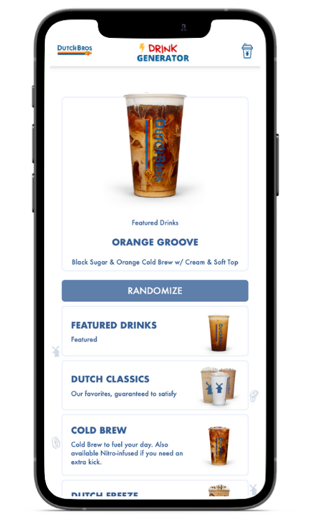

<h1 align="center">
   
  
  <!--  
  Drink Generator
    -->
</h1>

<h4 align="center">Random drink generator for Dutch Bros Coffee.</h4>

 <a href="#screenshots">Screenshots</a> •
  <a href="#demo">Demo</a> •
  <a href="#key-features">Key Features</a> •
  <a href="#Built-with">Built With</a>

## Screenshots

## Demo

* View [here](https://dutch-bros-drink-generator.vercel.app/)

## Key Features

* Drinks fetched with Server Side Rendering for increased initial page load speed
* Drinks are automatically added as Dutch Bros updates their menu.
* Select a random drink from selected categories or the entire menu.

## Built With

* JavaScript
* Next.js
* Tailwind CSS
* Vercel
